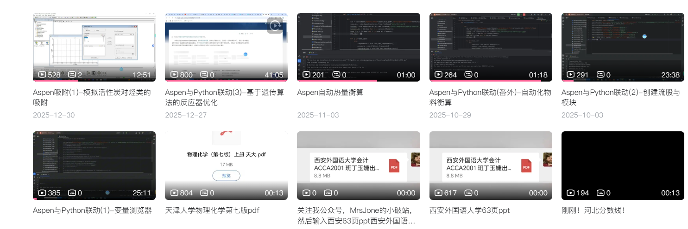

        各位好，这个文档主要来说明Python与Aspen联动的时候一些问题和答疑，之前第一章和第二章用到了一个叫做AspenPy的模块，不是原生态的(但是原理几乎一样),同时，在我做能量衡算的时候遇到了一些问题，这些问题网上几乎都没有侧重来讲，比如如何控制单位一样，以及Aspen与可迭代器的关系。而今天的内容是直接用原生态wincom32接口来实现用Python和Aspen通过COM接口的一些转化。

        本文档开源，可以进行分享！




# **第一部分 之前内容复习及其快速浏览**

**0-变量浏览器**


**1-Aspen怎么启动:**

```VBScript
aspen = win32.Dispatch('Apwn.Document')
时间:13.560933828353882
```

两点

1.这个程序只是启动aspen，并不是aspen的某一个特定文件

2.版本其实无所谓


或者

```VBScript
aspen = win32.gencache.EnsureDispatch('Apwn.Document')
时间:13
```

**2.启动哪个文件?**

```VBScript
aspen.InitFromArchive2(os.path.abspath('BkpDir/FlashTest.bkp'))
```

os.path.abspath是**相对路径**转换成**绝对路径**

这个aspen.InitFromArchive2括号里面要求的是绝对路径，而你假设只有相对路径，则可以这么填，如果你有绝对路径，则

```VBScript
aspen.InitFromArchive2(r'D:\python pa chong\pythonwithaspen\bkpdir\FlashTest.bkp')
```

**3.Aspen是否可视化**

```VBScript
aspen.Visible=1 or aspen.Visible=0
```

注意:不管是0还是1，你这个Aspen都是有后台进程


**4.关闭:**

```VBScript
aspen.Close()
```

**5.如何获取一个bkp的物质名字**


```VBScript
concent=Aspen.Tree.FindNode("\Data\Components\Specifications\Input\CASN")
Concent_all=[j.Name for j in concent.Elements]
```


同理，如果是想获得CAS号就直接

```VBScript
concent=Aspen.Tree.FindNode("\Data\Components\Specifications\Input\CASN")
Concent_all=[j.Value for j in concent.Elements]
```

# **第二部分 一些比较偏的问题及其解决方法**

这次主要是讲解三个问题

**一.Aspen不同文件有不同的单位集，怎么切换单位**

方法:

1.找到合适单位集，然后进行转化

2.运行，如果不运行的话不行

```VBScript
aspen.Tree.Elements('Data').Elements("Setup").Elements("Global").Elements("Input").Elements("INSET").Value="MET"
aspen.Run()
```

**二.怎么获取流股数据**

1.获取流股名字(使用Name)

两个方式:

(1).通过FindNode直接获取

```VBScript
Name_Block_All=aspen.Tree.FindNode("\Data\Streams")
Name_Block_List=[i.Name for i in Name_Block_All.Elements]
```

这个是Python的语法糖，相当于

```VBScript
Name_Block_All=aspen.Tree.FindNode("\Data\Streams")
Name_Block_List=[]
for i in Name_Block_All.Elements:
  Name_Block_List.append(i.Name)
```

这个可以当作使用了For循环的迭代思想

[迭代器和生成器](Python与Aspen联动的一些技巧总结/迭代器和生成器.md)

[aspen.Tree.FindNode().Elements是不是可迭代对象？](Python与Aspen联动的一些技巧总结/aspen.Tree.FindNode++.Elements是不是可迭代对象.md)

(2)可以用elements

```VBScript
Name_Block_All=aspen.Tree.Elements("Data").Elements("Stream")
Name_Block_List=[i.Name for i in Name_Block_All.Elements]
```


(3)通过Item列表

```VBScript

Name_Block_List=[]
streams_node=aspen.Tree.Elements("Data").Elements("Stream")
for i in range(1,streams_node.Elements.Count+1):
  Name_Block_List.append(streams_node.Elements.Item(i).Name)

```

这个等同于

```VBScript
Name_Block_List=[]
i=0
while i<streams_node.Elements.Count:
  Name_Block_List.append(streams_node.Elements.Item(i).Name)
  i+=1

```

或者由于列表的思想,我们可以再转化

```VBScript
elements = list(Name_Block_All.Elements)   # 一次性固化
for i in range(len(elements)):
    print(elements[i].Name)
```

或者,迭代器思想

```VBScript
it = iter(Name_Block_All.Elements)
while True:
    try:
        elem = next(it)
    except StopIteration:
        break
    print(elem.Name)
```

2.获取流股的的输入数据

```VBScript
Volumn_Flow=Aspen.Tree.Elements("Data").Elements("Streams").Elements(Stream_Name).Elements("input").Elements("VOLFLMX2").Value

```

3.获取流股的输出数据

```VBScript
Volumn_Flow=Aspen.Tree.Elements("Data").Elements("Streams").Elements(Stream_Name).Elements("Output").Elements("VOLFLMX2").Value
```

4.修改流股的输入数据

```VBScript
Aspen.Tree.Elements("Data").Elements("Streams").Elements(Stream_Name).Elements("input").Elements("VOLFLMX2").Value=0.06

```

5.修改流股的输出数据

```VBScript
Aspen.Tree.Elements("Data").Elements("Streams").Elements(Stream_Name).Elements("Output").Elements("VOLFLMX2").Value=0.06
```

**三.怎么获取模块的输出数据**

1.获取模块的输入数据

首先，这里的大小写都一样,都不影响结果

两种方式，第一种是**Elements形式:**

```VBScript
Aspen.Tree.Elements("Data").Elements("Blocks")
```

第二种是FindNote形式

```VBScript
Aspen.Tree.FindNode("\Data\Streams")
```

2.获取模块的输出数据

**四.怎么创建和删除流股,模块,流股和模块之间怎么连接起来**

1.模块

创建模块:`Add()`

```VBScript
BlockName="0101"
EquipmentType=["RCSTR", "RPlug", "DSTWU", "Flash2", "Mixer", "Heater", "Radfrac", "Splitter", "RYield]#从中选一个
All=BlockName+"!"+"RPlug"
Aspen.Tree.Elements("Data").Elements("Blocks").Elements.Add(All)
```


这是设备类型的选项，可以对这个进行查看

删除模块:`Remove()`

```VBScript
Aspen.Tree.Elements("Data").Elements("Blocks").Elements.Remove("Blockname")
```

2.流股

创建流股:`Add()`

```VBScript
StreamName="0101"
EquipmentType=["MATERIAL", "HEAT", "WORK","POWER"]#从中选一个
All=StreamName+"!"+"MATERIAL"
Aspen.Tree.Elements("Data").Elements("Streams").Elements.Add(All)
```


删除流股:`Remove()`

```VBScript
Aspen.Tree.Elements("Data").Elements("Streams").Elements.Remove("StreamName")
```

连接流股:`Add()`这里虽然看似是连接流股，实际上用到的和模块有关

```VBScript
Aspen.Tree.Elements("Data").Elements("Blocks").Elements("Ports").Elements(Portname).Elements.Add(Streamname)
port_Name="D(OUT)" , "B(OUT)", "F(IN)"
```


断开流股:

```VBScript
Aspen.Tree.Elements("Data").Elements("blocks").Elements(Blockname).Elements("Ports").Elements(Portname).Elements.Remove(Streamname)
```


重要的点

**大小写并不影响**

# 第三部分:可能用到的方法及其保存方法

**杂项指令:**

1.显示Aspen的文件地址

```VBScript
Aspen.FullName
#D:\aspenruanjian\Aspen Plus V14.0\GUI\Xeq\aspenplus.exe
```

2.抑制窗口

```VBScript
Aspen.SuppressDialogs = 1 or 0
#1表示抑制，0表示不抑制
```

3.运行模拟

```VBScript
Aspen.Run2()
```

4.停止模拟

```VBScript
Aspen.Stop()
```

5.重置模块

```VBScript
Aspen.Reinit()
```

6.模块重置#已经删除

```VBScript
Aspen.Tree.Elements("Data").Elements("Blocks").Elements(Blockname).Reinit()
```

7.流股重置#已经删除

```VBScript
Aspen.Tree.Elements("Data").Elements("Streams").Elements(StreamName).Reinit()
```

**保存:**

8.保存成apw，有所有的输入及其输出

```VBScript
Aspen.Save()
```

9.保存当前 Aspen 模拟（.apw）为新名称，而不覆盖原文件。
参数：
Filename：指定文件名的字符串。
overwrite：当文件已存在时是否覆盖？True 或 False，默认值为 True

```VBScript
Aspen.SaveAs(Filename, overwrite)
```

10.保存成bkp文件

```VBScript
Aspen.Export(1, filename)
```

11.保存成.rep或者.txt文件

```VBScript
Aspen.Export(2, filename)
```

12,保存成.sum

```VBScript
Aspen.Export(4, filename)
```

13.保存成.inp

```VBScript
Aspen.Export(5, filename)
```

14.保存每次模拟的信息，错误和警告:

```VBScript
Aspen.Export(6, filename)
```

15.导出仿真报告

```VBScript
Aspen.Export(9, filename)
```

16.导出压力驱动的模拟报告

```VBScript
Aspen.Export(10, filename)
```

17.导出流程图的绘图

```VBScript
Aspen.Export(11,filename)
```


各位可以加入这个交流群一起交流！


一些比较好的化工链接:

1.CEPD化工社区:

[https://bbs.imbhj.com/](https://bbs.imbhj.com/)

2.我的公众号:MrsJone的破站(会分享关于Aspen和Python的一些文章)

3.世示其up主的化工设计大赛管道选型,这个exe文件可以找up主三连获取


4.能量衡算系统-可以用于化工设计大赛:

进我那个群自领


5.AspenPy模块的github链接-我一开始用的Aspen和Python连接的库，可以给原作者star

[https://github.com/YouMayCallMeJesus/AspenPlus-Python-Interface](https://github.com/YouMayCallMeJesus/AspenPlus-Python-Interface)


