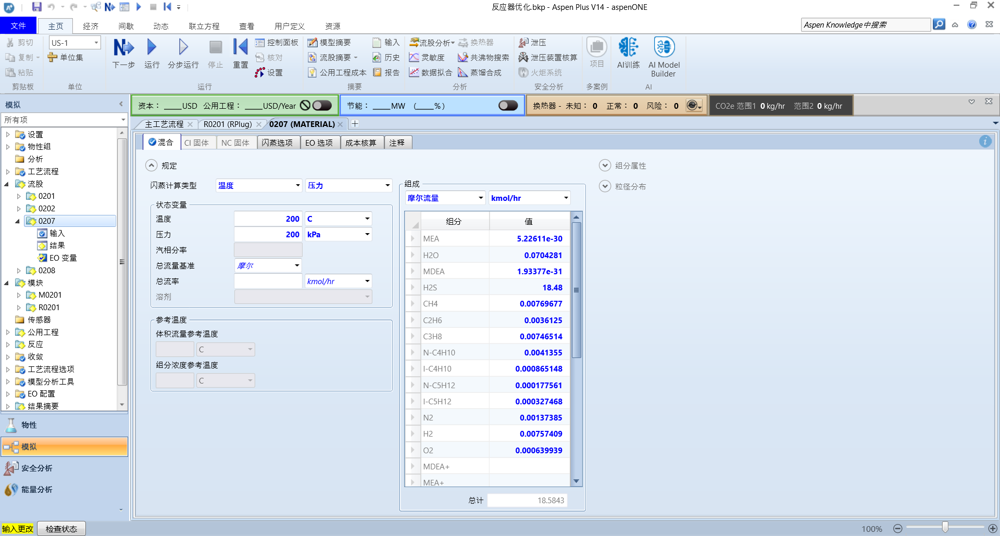
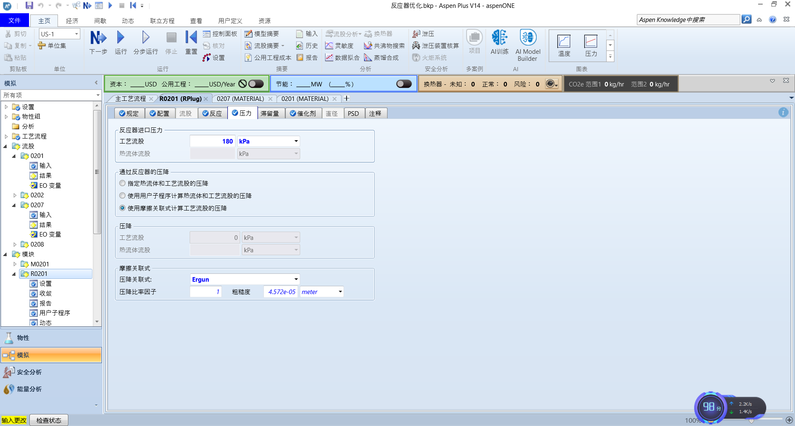
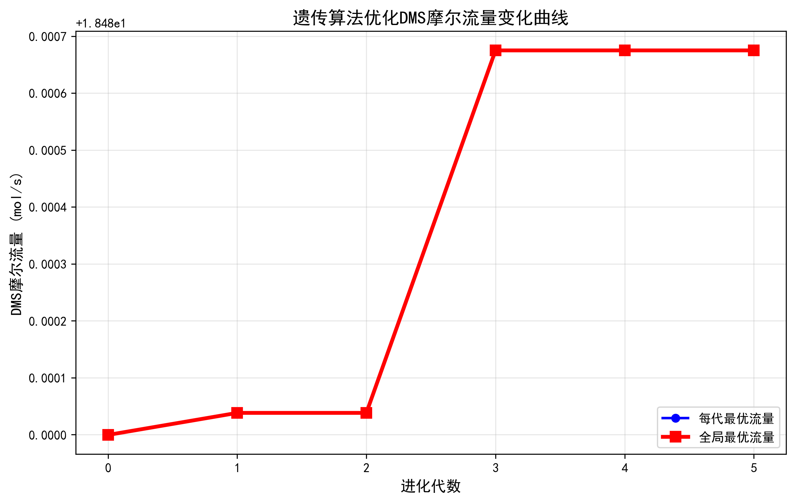

推荐视频

[https://www.bilibili.com/video/BV1s44y1z7xt/?spm_id_from=333.337.search-card.all.click&vd_source=2d83054edea4aad2d47e22246dc0ccf3](https://www.bilibili.com/video/BV1s44y1z7xt/?spm_id_from=333.337.search-card.all.click&vd_source=2d83054edea4aad2d47e22246dc0ccf3)

各位好，本项目是基于Python和遗传算法对沧州交通学院砜起云涌队第二工段DMS合成工段进行研究


1.文章梗概

通读文献，我们知道在此反应中温度大概在50-400℃，压力在100-300Kpa左右，进料比为1:2,长径比不大于3，长度为0-2左右,DMS的流量为10-70kmol/h(骗你的其实我没有读文献，我随便搞了个区间)所以，我们先尝试将







这里，我们将温度设为200℃，长度直径分别为1.8，1.2，长径比为1.5，压力为180kpa,甲醇流量为18kmol,运行可以得到DMS的含量为0.08kmol(很明显不符合)

我们现在要做的是，将产品DMS的摩尔流量目标函数，然后将长度，直径，长径比，压力，温度，甲醇流量设为约束和变量,使用遗传算法得出最大值

2.遗传算法

2.1遗传算法的定义

遗传算法（Genetic Algorithm, GA）是模拟达尔文生物进化论的自然选择和遗传学机理的生物进化过程的计算模型，是一种通过模拟自然进化过程搜索最优解的方法。

2.2执行过程

遗传算法是从代表问题可能潜在的解集的一个种群（population）开始的，而一个种群则由经过基因（gene）编码的一定数目的个体(individual)组成。每个个体实际上是染色体(chromosome)带有特征的实体。

染色体作为遗传物质的主要载体，即多个基因的集合，其内部表现（即基因型）是某种基因组合，它决定了个体的形状的外部表现，如黑头发的特征是由染色体中控制这一特征的某种基因组合决定的。因此，在一开始需要实现从表现型到基因型的映射即编码工作。由于仿照基因编码的工作很复杂，我们往往进行简化，如二进制编码。

初代种群产生之后，按照适者生存和优胜劣汰的原理，逐代（generation）演化产生出越来越好的近似解，在每一代，根据问题域中个体的适应度（fitness）大小选择（selection）个体，并借助于自然遗传学的遗传算子（genetic operators）进行组合交叉（crossover）和变异（mutation），产生出代表新的解集的种群。

这个过程将导致种群像自然进化一样的后生代种群比前代更加适应于环境，末代种群中的最优个体经过解码（decoding），可以作为问题近似最优解。

2.3图解


2.4实现过程

1. 首先寻找一种对问题潜在解进行“数字化”编码的方案。（建立表现型和基因型的映射关系）

2. 随机初始化一个种群（那么第一批袋鼠就被随意地分散在山脉上），种群里面的个体就是这些数字化的编码。

3. 接下来，通过适当的解码过程之后（得到袋鼠的位置坐标）。

4. 用适应性函数对每一个基因个体作一次适应度评估（袋鼠爬得越高当然就越好，所以适应度相应越高）。

5. 用选择函数按照某种规定择优选择（每隔一段时间，射杀一些所在海拔较低的袋鼠，以保证袋鼠总体数目持平。）。

6. 让个体基因变异（让袋鼠随机地跳一跳）。

7. 然后产生子代（希望存活下来的袋鼠是多产的，并在那里生儿育女）。

由此我们可以得出遗传算法的一般步骤：

1. 随机产生种群。

2. 根据策略判断个体的适应度，是否符合优化准则，若符合，输出最佳个体及其最优解，结束。否则，进行下一步。

3. 依据适应度选择父母，适应度高的个体被选中的概率高，适应度低的个体被淘汰。

4. 用父母的染色体按照一定的方法进行交叉，生成子代。

5. 对子代染色体进行变异。

6. 由交叉和变异产生新一代种群，返回步骤2，直到最优解产生。

由于本章主要讲实例，所以我们这里不讲详细，具体可以看

[https://blog.csdn.net/zyx_bx/article/details/115188782](https://blog.csdn.net/zyx_bx/article/details/115188782)

3.模型的建立

首先，我们先建立模型，我们想让流股产物DMS的含量最大,所以设目标函数DMS摩尔流量最大值

目标函数:DMS摩尔流量的最大值

$max \ \ \ F_{DMS,out}$

我们接下来设约束变量，我们知道操纵变量为温度，压力，长度，直径和甲醇的含量。

所以我们设

约束变量:

1.反应器温度***T*** 为200-400


2.长度与直径***L、D***

长度:1-2m

(由于我要设L/D≤3，所以不约束直径的长度)

3.长径比的比例不能大于3

$\frac{L}{D}\leq3$

4.压力:100-300kpa

$100kpa\leq P\leq300kpa$

完整优化模型:

$max\ \ \ \ F_{DMS\_out}\\
s.t.\begin{cases}200\leq T\leq400\\ 1 \leq L \leq 2 \\ \frac{L}{d}\leq 3 \\ 100\leq P \leq 300 \\ d>0,L>0\end{cases}$

所以我们进行求解:

遗传算法:

```Python
# ===================== 模块1：基础配置（一眼看懂） =====================
import time
import random
import matplotlib.pyplot as plt

# 1. 约束条件（直接定义，不用函数）
CONSTRAINTS = {
    "TEMP": (200, 400),  # 温度范围
    "LENGTH": (1, 2),  # 长度范围
    "PRES": (100, 300),  # 压力范围
    "L_D_MAX": 3  # 长径比≤3
}

# 2. 绘图初始化（极简版）
plt.rcParams["font.sans-serif"] = ["SimHei"]  # 中文显示
fig, ax = plt.subplots(figsize=(8, 5))
ax.set_xlabel("进化代数"), ax.set_ylabel("DMS摩尔流量 (mol/s)")
ax.set_title("DMS流量优化曲线"), ax.grid(True, alpha=0.3)
line1, = ax.plot([], [], "b-o", label="每代最优")  # 蓝色=每代最优
line2, = ax.plot([], [], "r-s", label="全局最优")  # 红色=全局最优
ax.legend(), plt.ion(), plt.show()


# ===================== 模块2：Aspen初始化（极简版） =====================
def init_aspen():
    """只做一件事：连接Aspen，返回参数对象"""
    from CodeLibrary import Simulation
    sim = Simulation(
        AspenFileName="反应器优化.bkp",
        WorkingDirectoryPath=r"D:\python pa chong\aspenpy-main\反应器设计",
        VISIBILITY=False
    )

    # 只返回需要的对象（路径和你完全一致）
    return {
        "sim": sim,
        "TEMP": sim.AspenSimulation.Tree.Elements("Data").Elements("Blocks").Elements("R0201").Elements(
            "Input").Elements("REAC_TEMP"),
        "LENGTH": sim.AspenSimulation.Tree.Elements("Data").Elements("Blocks").Elements("R0201").Elements(
            "Input").Elements("LENGTH"),
        "DIAM": sim.AspenSimulation.Tree.Elements("Data").Elements("Blocks").Elements("R0201").Elements(
            "Input").Elements("DIAM"),
        "PRES": sim.AspenSimulation.Tree.Elements("Data").Elements("Blocks").Elements("R0201").Elements(
            "Input").Elements("PRES"),
        "DMS": sim.AspenSimulation.Tree.FindNode(r"\Data\Streams\0208\Output\MOLEFLOW\MIXED\DMS")
    }
# ===================== 模块3：Aspen模拟（极简版） =====================
def run_aspen(aspen_obj, params):
    """
    只做一件事：传入参数，返回DMS流量
    params = [温度, 长度, 直径, 压力]
    """
    temp, length, diam, pres = params
    # 1. 简单约束校验（一行判断）
    if not (CONSTRAINTS["TEMP"][0] <= temp <= CONSTRAINTS["TEMP"][1] and
            CONSTRAINTS["LENGTH"][0] <= length <= CONSTRAINTS["LENGTH"][1] and
            CONSTRAINTS["PRES"][0] <= pres <= CONSTRAINTS["PRES"][1] and
            diam > 0 and length / diam <= CONSTRAINTS["L_D_MAX"]):
        return 0  # 非法参数返回0
    # 2. 修改参数+运行模拟
    aspen_obj["TEMP"].Value = temp
    aspen_obj["LENGTH"].Value = length
    aspen_obj["DIAM"].Value = diam
    aspen_obj["PRES"].Value = pres
    aspen_obj["sim"].EngineRun()

    # 3. 返回流量（只返回结果，不打印冗余信息）
    return aspen_obj["DMS"].Value


# ===================== 模块4：遗传算法（极简核心版） =====================
def simple_ga(aspen_obj):
    """
    极简遗传算法：只保留核心逻辑，去掉冗余输出，只打印关键信息
    """
    # 算法参数（极简配置，新手易调）
    POP_SIZE = 20  # 种群大小（越小越快）
    GEN_NUM = 20  # 进化代数（越少越快）
    CROSS_RATE = 0.8  # 交叉概率
    MUT_RATE = 0.1  # 变异概率

    # 初始化数据（绘图用）
    gen_list, gen_best, global_best = [], [], []
    best_flow = 0  # 全局最优流量
    best_params = []  # 全局最优参数

    # 步骤1：生成初始种群（5个合法参数组合）
    def create_params():
        """生成一个合法的参数组合"""
        while True:
            t = random.uniform(*CONSTRAINTS["TEMP"])
            l = random.uniform(*CONSTRAINTS["LENGTH"])
            d = random.uniform(l / CONSTRAINTS["L_D_MAX"], 2)
            p = random.uniform(*CONSTRAINTS["PRES"])
            if l / d <= CONSTRAINTS["L_D_MAX"]:
                return [t, l, d, p]

    population = [create_params() for _ in range(POP_SIZE)]

    # 步骤2：逐代进化（核心循环，只有10行）
    for gen in range(GEN_NUM):
        # 2.1 评估所有个体的流量
        flows = [run_aspen(aspen_obj, p) for p in population]

        # 2.2 记录最优值（绘图+打印）
        current_best = max(flows)
        if current_best > best_flow:
            best_flow = current_best
            best_params = population[flows.index(current_best)]
        gen_list.append(gen), gen_best.append(current_best), global_best.append(best_flow)
        print(f"第{gen + 1}代 | 本代最优：{current_best:.6f} | 全局最优：{best_flow:.6f}")
        # 2.3 选择（轮盘赌，极简版）
        total = sum(flows) if sum(flows) > 0 else 1
        probs = [f / total for f in flows]
        parents = [population[random.choices(range(POP_SIZE), weights=probs)[0]] for _ in range(POP_SIZE)]

        # 2.4 交叉（单点交叉，极简版）
        offspring = []
        for i in range(0, POP_SIZE, 2):
            p1, p2 = parents[i], parents[i + 1] if i + 1 < POP_SIZE else parents[i]
            if random.random() < CROSS_RATE:
                cp = random.randint(1, 3)
                offspring.append(p1[:cp] + p2[cp:]), offspring.append(p2[:cp] + p1[cp:])
            else:
                offspring.append(p1), offspring.append(p2)
        offspring = offspring[:POP_SIZE]

        # 2.5 变异（小幅扰动，极简版）
        for i in range(POP_SIZE):
            if random.random() < MUT_RATE:
                offspring[i] = [
                    offspring[i][0] + random.uniform(-5, 5),
                    offspring[i][1] + random.uniform(-0.05, 0.05),
                    offspring[i][2] + random.uniform(-0.02, 0.02),
                    offspring[i][3] + random.uniform(-5, 5)
                ]

        # 2.6 更新种群+刷新绘图
        population = offspring
        line1.set_data(gen_list, gen_best), line2.set_data(gen_list, global_best)
        ax.relim(), ax.autoscale_view(), plt.pause(0.1)

    # 步骤3：结束后保存图表+返回结果
    plt.ioff(), plt.savefig("DMS优化曲线.png", dpi=200)
    return best_params, best_flow


# ===================== 主程序（一行调用，极简） =====================
if __name__ == "__main__":
    # 1. 初始化Aspen
    aspen_obj = init_aspen()

    # 2. 运行极简遗传算法
    best_params, best_flow = simple_ga(aspen_obj)

    # 3. 打印最终结果（只打印关键信息）
    print("\n===== 最终结果 =====")
    print(
        f"最优参数：温度={best_params[0]:.1f}℃, 长度={best_params[1]:.2f}m, 直径={best_params[2]:.2f}m, 压力={best_params[3]:.1f}kPa")
    print(f"最大DMS流量：{best_flow:.6f} mol/s")

    # 4. 关闭Aspen
    aspen_obj["sim"].CloseAspen()
```




可以看出流量很高，但是温度比较大。

好了，现在有个问题,我们现在不能盲目的让DMS产量最高，温度和压力，甲醇浓度也有成本，所以我们要保证DMS的前提下使得温度，压力和甲醇的量最低,所以我们需要用多目标规划，这里我们使用权重

$\text{评分} = (\text{DMS产量} \times \text{奖励权重})\\ - (\text{温度} \times \text{惩罚权重})\\ - (\text{压力} \times \text{惩罚权重}) - (\text{甲醇} \times \text{惩罚权重})$

这里我们使得奖励权重为5000,温度惩戒权重为100，压力惩戒为1,原料惩戒为100


这是代码

```Python
# ===================== 模块1：基础配置 =====================
import time
import random
import matplotlib.pyplot as plt

# 1. 约束条件
CONSTRAINTS = {
    "TEMP": (100, 500),  # 温度范围
    "LENGTH": (1, 5),  # 长度范围
    "PRES": (50, 400),  # 压力范围
    "L_D_MAX": 3,  # 长径比限制
    "FLOW": (10, 80),  # 甲醇进料范围
}

# 【新增】权重配置：决定了你更看重什么
# 提示：由于DMS产量数值很小(可能是0.x)，而温度数值很大(300+)，
# 必须给DMS一个巨大的系数，否则优化器会为了降低温度而放弃产量。
WEIGHTS = {
    "DMS_REWARD": 5000,  # 产量的奖励系数 (调大它，更看重产量)
    "TEMP_COST": 10.0,  # 温度的惩罚系数 (调大它，更想低温)
    "PRES_COST": 1,  # 压力的惩罚系数 (调大它，更想低压)
    "MEOH_COST": 100.0  # 原料的惩罚系数 (调大它，更想省原料)
}

# 2. 绘图初始化
plt.rcParams["font.sans-serif"] = ["SimHei"]
plt.rcParams['axes.unicode_minus'] = False  # 解决负号显示问题
fig, ax = plt.subplots(figsize=(8, 5))
ax.set_xlabel("进化代数"), ax.set_ylabel("综合评分 (Score)")  # 改名
ax.set_title("多目标优化进程"), ax.grid(True, alpha=0.3)
line1, = ax.plot([], [], "b-o", label="每代最高分")
line2, = ax.plot([], [], "r-s", label="全局最高分")
ax.legend(), plt.ion(), plt.show()


# ===================== 模块2：Aspen初始化 (不变) =====================
def init_aspen():
    from CodeLibrary import Simulation
    sim = Simulation(
        AspenFileName="反应器优化.bkp",
        WorkingDirectoryPath=r"D:\python pa chong\aspenpy-main\反应器设计2",
        VISIBILITY=False
    )
    return {
        "sim": sim,
        "TEMP": sim.AspenSimulation.Tree.Elements("Data").Elements("Blocks").Elements("R0201").Elements(
            "Input").Elements("REAC_TEMP"),
        "LENGTH": sim.AspenSimulation.Tree.Elements("Data").Elements("Blocks").Elements("R0201").Elements(
            "Input").Elements("LENGTH"),
        "DIAM": sim.AspenSimulation.Tree.Elements("Data").Elements("Blocks").Elements("R0201").Elements(
            "Input").Elements("DIAM"),
        "PRES": sim.AspenSimulation.Tree.Elements("Data").Elements("Blocks").Elements("R0201").Elements(
            "Input").Elements("PRES"),
        "FLOW": sim.AspenSimulation.Tree.FindNode(r"\Data\Streams\0201\Input\TOTFLOW\MIXED"),
        "DMS": sim.AspenSimulation.Tree.FindNode(r"\Data\Streams\0208\Output\MOLEFLOW\MIXED\DMS"),
    }


# ===================== 模块3：Aspen模拟与评分 (核心修改) =====================
def run_aspen(aspen_obj, params):
    """
    现在返回的是【综合评分】，而不仅仅是DMS流量
    """
    temp, length, diam, pres, flow = params

    # 1. 约束校验
    if not (CONSTRAINTS["TEMP"][0] <= temp <= CONSTRAINTS["TEMP"][1] and
            CONSTRAINTS["LENGTH"][0] <= length <= CONSTRAINTS["LENGTH"][1] and
            CONSTRAINTS["PRES"][0] <= pres <= CONSTRAINTS["PRES"][1] and
            diam > 0 and length / diam <= CONSTRAINTS["L_D_MAX"] and
            CONSTRAINTS["FLOW"][0] <= flow <= CONSTRAINTS["FLOW"][1]):
        return 1e-6  # 非法参数返回极小正数（避免报错）

    # 2. 运行模拟
    aspen_obj["TEMP"].Value = temp
    aspen_obj["LENGTH"].Value = length
    aspen_obj["DIAM"].Value = diam
    aspen_obj["PRES"].Value = pres
    aspen_obj["FLOW"].Value = flow
    aspen_obj["sim"].EngineRun()

    # 3. 获取结果
    dms_yield = aspen_obj["DMS"].Value

    # 4. 【核心】计算综合评分
    # 逻辑：收益 - 成本
    score = (dms_yield * WEIGHTS["DMS_REWARD"]) - \
            (temp * WEIGHTS["TEMP_COST"]) - \
            (pres * WEIGHTS["PRES_COST"]) - \
            (flow * WEIGHTS["MEOH_COST"])

    # 遗传算法的轮盘赌选择需要正数，如果分数为负，强制设为极小值
    return max(score, 1e-6)


# ===================== 模块4：遗传算法 (微调) =====================
def simple_ga(aspen_obj):
    POP_SIZE = 20
    GEN_NUM = 20
    CROSS_RATE = 0.8
    MUT_RATE = 0.1

    gen_list, gen_best, global_best = [], [], []
    best_score = -99999  # 初始设为很小
    best_params = []

    # 生成初始种群
    def create_params():
        while True:
            t = random.uniform(*CONSTRAINTS["TEMP"])
            l = random.uniform(*CONSTRAINTS["LENGTH"])
            d = random.uniform(l / CONSTRAINTS["L_D_MAX"], 2)
            p = random.uniform(*CONSTRAINTS["PRES"])
            f = random.uniform(*CONSTRAINTS["FLOW"])
            if l / d <= CONSTRAINTS["L_D_MAX"]:
                return [t, l, d, p, f]

    population = [create_params() for _ in range(POP_SIZE)]

    for gen in range(GEN_NUM):
        # 2.1 评估所有个体的【综合评分】
        scores = [run_aspen(aspen_obj, p) for p in population]

        # 2.2 记录
        current_best_score = max(scores)
        if current_best_score > best_score:
            best_score = current_best_score
            best_params = population[scores.index(current_best_score)]

        gen_list.append(gen)
        gen_best.append(current_best_score)
        global_best.append(best_score)

        print(f"第{gen + 1}代 | 本代最高分：{current_best_score:.2f} | 全局最高分：{best_score:.2f}")

        # 2.3 选择 (轮盘赌)
        total = sum(scores)
        # 防止所有分数为极小值导致 total=0
        if total <= 1e-5: total = 1
        probs = [s / total for s in scores]
        parents = [population[random.choices(range(POP_SIZE), weights=probs)[0]] for _ in range(POP_SIZE)]

        # 2.4 交叉
        offspring = []
        for i in range(0, POP_SIZE, 2):
            p1, p2 = parents[i], parents[i + 1] if i + 1 < POP_SIZE else parents[i]
            if random.random() < CROSS_RATE:
                cp = random.randint(1, 4)  # 注意参数变多了，切点范围扩大
                offspring.append(p1[:cp] + p2[cp:])
                offspring.append(p2[:cp] + p1[cp:])
            else:
                offspring.append(p1), offspring.append(p2)
        offspring = offspring[:POP_SIZE]

        # 2.5 变异
        for i in range(POP_SIZE):
            if random.random() < MUT_RATE:
                offspring[i] = [
                    offspring[i][0] + random.uniform(-10, 10),  # 温度变异幅度大点
                    offspring[i][1] + random.uniform(-0.1, 0.1),
                    offspring[i][2] + random.uniform(-0.05, 0.05),
                    offspring[i][3] + random.uniform(-10, 10),
                    offspring[i][4] + random.uniform(-5, 5)  # 流量变异
                ]

        population = offspring
        line1.set_data(gen_list, gen_best)
        line2.set_data(gen_list, global_best)
        ax.relim(), ax.autoscale_view(), plt.pause(0.1)

    plt.ioff(), plt.savefig("多目标优化结果114514.png", dpi=200)
    return best_params, best_score


# ===================== 主程序 =====================
if __name__ == "__main__":
    aspen_obj = init_aspen()

    print("开始多目标优化（最大化DMS，最小化T/P/甲醇）...")
    best_params, best_score = simple_ga(aspen_obj)

    # 拿到最优参数后，最后跑一次Aspen看看具体的物理数值
    # 因为simple_ga返回的是“分数”，我们需要看“实际DMS是多少”
    aspen_obj["TEMP"].Value = best_params[0]
    aspen_obj["LENGTH"].Value = best_params[1]
    aspen_obj["DIAM"].Value = best_params[2]
    aspen_obj["PRES"].Value = best_params[3]
    aspen_obj["FLOW"].Value = best_params[4]
    aspen_obj["sim"].EngineRun()
    final_dms = aspen_obj["DMS"].Value

    print("\n===== 最终优化结果 =====")
    print(f"综合评分：{best_score:.2f}")
    print(f"最优变量：")
    print(f"  - 温度: {best_params[0]:.2f} C (越低越好)")
    print(f"  - 压力: {best_params[3]:.2f} kPa (越低越好)")
    print(f"  - 甲醇: {best_params[4]:.2f} mol/s (越低越好)")
    print(f"  - 长度: {best_params[1]:.2f} m")
    print(f"  - 直径: {best_params[2]:.2f} m")
    print(f"最终产出：")
    print(f"  - DMS产量: {final_dms:.6f} mol/s")

    aspen_obj["sim"].CloseAspen()
```


结论:

多目标规划+遗传算法比普通遗传算法的性能更高

模型的缺点:

1.遗传算法的参数需要不断调试

2.多目标规划的惩罚系数也需要多调试才能得到合适的结果

3.这个是基于每个都可以运行成功，如果运行不成功的话需要输出错误或者警告，这块功能没有添加

参考文献:

1.【算法】超详细的遗传算法(Genetic Algorithm)解析[https://blog.csdn.net/zyx_bx/article/details/115188782](https://blog.csdn.net/zyx_bx/article/details/115188782)

2.CodeLibrary库:

[https://github.com/YouMayCallMeJesus/AspenPlus-Python-Interface](https://github.com/YouMayCallMeJesus/AspenPlus-Python-Interface)

3.Python使用灵敏度进行闪蒸

[https://bbs.imbhj.com/t/topic/397](https://bbs.imbhj.com/t/topic/397)


题外：

1.这个讲的可能不太详细，具体的可以去我b站看视频，我大概12月28号左右


2.可以关注我的Python和aspen联动QQ交流群:
群号:56721026

学习资料与群文件都放在这里


