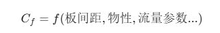
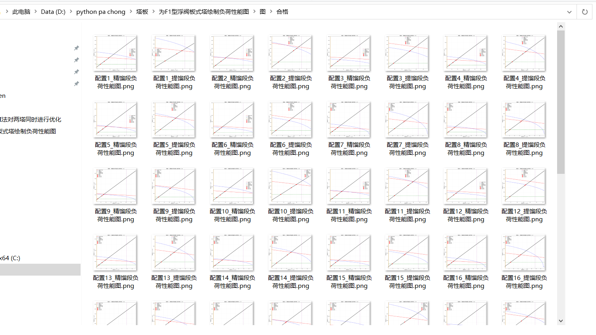
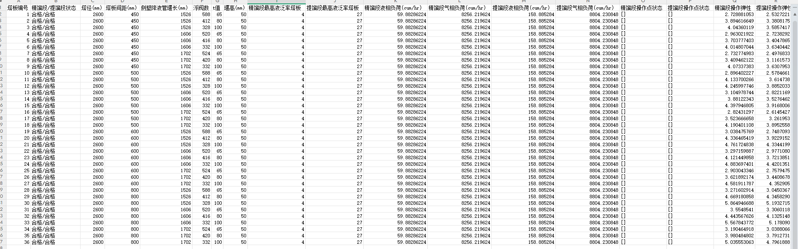
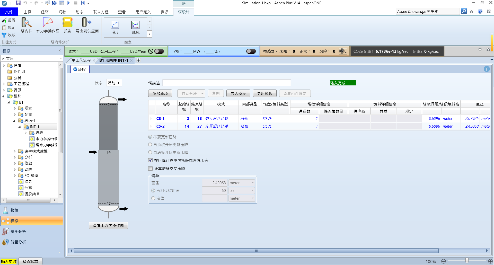
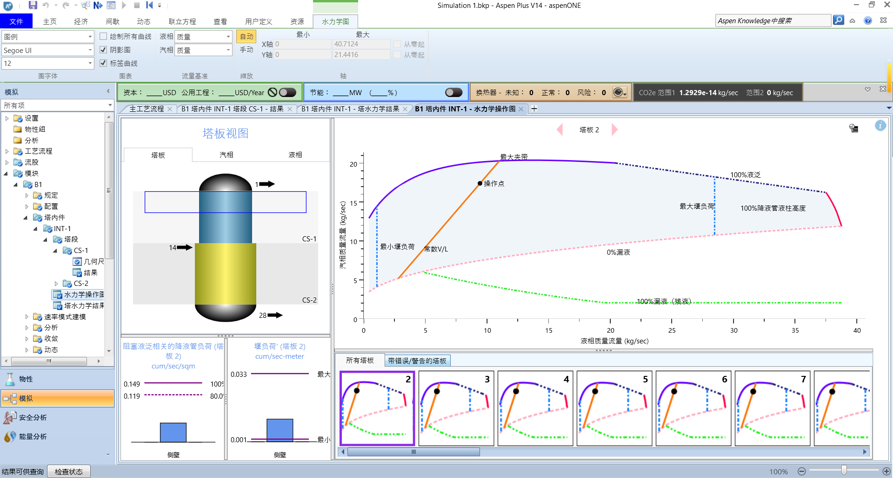
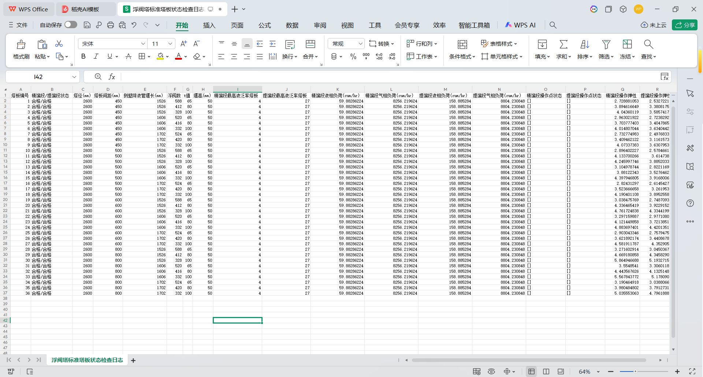
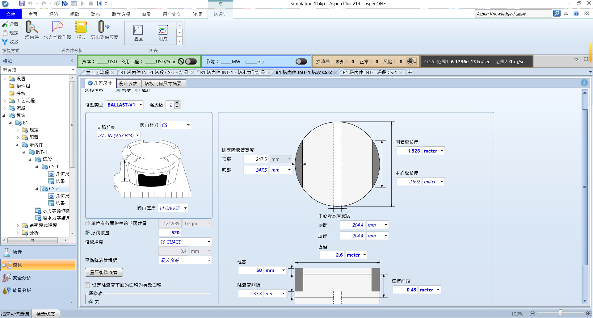
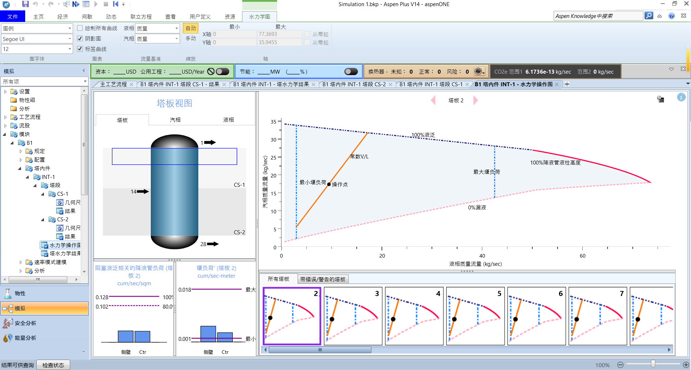

**摘要：** 手工算塔板就像在电子厂拧螺丝。为了探索效率的极限，我们的群友**帮倒忙**尝试用 Python (COM) 控制 Aspen，并训练了一个简单的 PyTorch 神经网络来拟合经验图表。这是一个 V0.1 版本的自动化校核原型，分享给大家

文件到时候会放在群链接，大家可以进我的QQ群获取:

Python与Aspen交流群:562721026


01 写在前面：一个“想偷懒”的念头

做化工设计的兄弟们都有过这种“至暗时刻”：

Aspen 模拟好不容易收敛了，以为能下班了，结果到了**水力学校核（Hydraulic Rating）**环节，还是得切回手动模式。

我们要对着那张祖传的《泛点负荷相关图》（或者史密斯图），眯着眼睛估读：“这大概是 0.12 还是 0.125？” 读完数据，再手算雾沫夹带、液泛因子。算完发现 **Flood > 85%**，红了。怎么办？改塔径，改板间距，**然后上述步骤全部重来一遍**。

**作为一名如果不写代码就手痒的大三学生，我一直在想：能不能把这个流程自动化？**

经过一个周末的折腾，我搭建了一个**基于 Python + 深度学习的初版脚本**。它目前还只是一个**原型（Prototype）**，肯定有不少 Bug，但它跑通了一个很有意思的逻辑闭环。

这个思路大致是这样的

1.运行程序，读取塔径等数据

2.选择单溢流还是双溢流

3.进行塔板结构几何结构生成（这个使用的是穷举法）

4.从Aspen获取具体的关键数据-粘度，表面张力等（这个需要提前输入）

5.用神经网络得到这几条线的拟合曲线和直线.

6.进行水力学核算

7.进行操作弹性分析

8.得到核算表格和图

今天发出来，权当抛砖引玉，供大家来看一番。

### 02 技术路线：把 Aspen 变成 Python 的“子程序”

传统的 Excel VBA 虽然能用，但扩展性有限。于是选择了 Python 的 `win32com` 库，通过 Windows 的 COM 接口，直接“接管” Aspen。

**原理拆解：** 利用 `win32com.client.Dispatch` 实例化 Aspen 文档对象。这相当于在后台开了一个“隐形”的 Aspen，可以直接读写其内存中的 **Variable Tree（变量树）**。

**代码实操：** 比起手动导出数据，这种“实时抓取”的方式显然更优雅：

```Plain Text
# 初始化 Aspen V14 (对应版本号 40.0，具体视安装版本而定)
aspen = win32.Dispatch('Apwn.Document.40.0')
aspen.InitFromArchive2(bkp_path)

# 自动寻找全塔负荷最高的“瓶颈板”
# 抓取液相密度 (HYD_RHOL) 和 粘度 (HYD_MUL)
rou_L = aspen.Tree.FindNode(f"/Data/Blocks/{block}/Output/HYD_RHOL/{stage}").Value
```

这就好比给 Aspen 装了个 API，虽然有时候连接不太稳定（老用户都懂 COM 接口的脾气），但只要连上了，数据提取就是毫秒级的事。

03 尝试：用神经网络“拟合”经验图表

这是本项目最“过度设计”（Overkill）但也最有趣的地方。

**痛点：**

浮阀塔设计的核心参数——**泛点负荷因数**  和 **充气系数** ，本质上是多变量非线性函数。



传统的做法是线性插值，或者用复杂的多项式拟合。

**群友的解法：** 既然是非线性映射，为什么不试试**神经网络**？ 群友尝试训练了一个轻量级的 **PyTorch 全连接网络 (MLP)**。不追求数学解析式，而是让神经网络去“学习”标准图表上的数据点分布。

**学术细节：**

- **模型架构**：2个输入层，第一层隐藏层32个神经元，激活判断，第二层隐藏层16个神经元，激活判断，第三层隐藏层16个神经元，激活判断，第四层隐藏层16个神经元，激活判断，输出层。

- **推理过程(应该是四层隐藏图，这里是一个实例)**：


```Plain Text
# 一个非常简单的全连接网络结构
class SimpleModel(nn.Module):
    def __init__(self):
        super().__init__()
        self.net = nn.Sequential(
            nn.Linear(2, 32), nn.ReLU(), # 引入非线性激活
            nn.Linear(32, 16), nn.ReLU(),
            nn.Linear(16, 1)
        )

# 加载训练好的模型权重 (.pth)
# 这一步代替了“人眼查图”
c_f = model(input_tensor).item()
```

当然，神经网络的准确性完全取决于训练数据的质量。目前的模型在标准工况下表现尚可，但在极端边界条件下（比如极小板间距或极端物性），**AI 可能会一本正经地胡说八道**。所以，它目前只能作为辅助参考，不能完全替代工程师的判断。

04 成果输出:输出Excel表格和图像

我用 `Matplotlib` 和 `OpenPyxl` 做了两套可视化输出，这也是这个脚本目前最实用的部分。

#### 1. 负荷性能图 (The Figure)

这是工程师最关心的“那张图”。脚本内置了国标水力学公式，尝试自动画出那五条“红线”：

- **过量雾沫夹带线 (Jet Flood)**

- **淹塔线 (Downcomer Flood)**

- **过量泄漏线 (Weeping)**

- **降液管超负荷线 (Downcomer Choke)**

- **液相负荷下限线**


程序会自动把**当前操作点（Operating Point）**用一个红色星号标在图上。

- **星号在圈里**：恭喜，设计大概率是稳的。

- **星号在圈外**：程序会冷酷地告诉你——“位于过量雾沫夹带线之上”，这时候你就得回去改塔径了。

### 05 落地验证：五条红线定生死

拿到了数据和系数，剩下的就是纯粹的流体力学计算。脚本内置了国标公式，尝试自动画出那五条“红线”：

1. **过量雾沫夹带线 (Jet Flood)**

2. **淹塔线 (Downcomer Flood)**

3. **过量泄漏线 (Weeping)**

4. **降液管超负荷线 (Downcomer Choke)**

5. **液相负荷下限线**

**可视化输出：** 利用 `Matplotlib` 绘制**负荷性能图 (Operating Window)**。

- **如果点在圈里**：初步判定合格。

- **如果点在圈外**：程序会提示具体原因（如“位于过量雾沫夹带线之上”）。

同时，尝试自动计算**操作弹性 (Turndown Ratio)**。虽然这个计算目前比较粗糙，主要通过遍历操作线与边界线的交点来实现，但在做初步选型时，确实能省不少按计算的时间(不用np遍历也可以，scipy可以直接求两个线的交点,但是那样下的库有点多了)。



#### 2. 诊断日志表 (The Excel Table)

除了画图，程序还会生成一份详细的 Excel 诊断日志。这不仅仅是个 Log，更像是一份**“塔板体检单”**。



表格里会记录：

- **自动遍历的方案**：塔径通过Aspen给出

- **瓶颈定位**：直接告诉你精馏段哪块板子负荷最高，提馏段哪块板子最危险。

- **操作弹性**：虽然目前的算法比较粗糙（基于几何交点），但能直接给出一个量化的数值（比如 2.5 或 3.0），做初步筛选非常方便。

06 进行实操

1.首先进行塔运行


2.进行塔的初始分段



3.运行，得到水力学结果



我们从这里可以看到，水力学是有警告的

4.所以我们运行我们的程序来进行优化:


5.进行计算后，我们查看Excel表，得到了经过计算后的塔径，塔间距等一些数据



6.我们回到Aspen,输入塔径、塔板间距


然后我们再输入几何尺寸参数

7.精馏段参数:


8.提馏段参数:



9.运行，得到水力学结果:



此时说明，水力学结果是正常的，至此，整块内容结束

### 07 总结与展望

这并不是一个成熟的商业软件，它更像是一个**“极客玩具”**。

这 500 多行代码，验证了一条打通 **Aspen (流程模拟)**、**Python (自动化)** 和 **PyTorch (数据拟合)** 的技术路径。它证明了化工设计中那些繁琐、重复的查图工作，是有可能被低成本数字化的。

**目前的不足：**

1. **鲁棒性**：COM 接口偶尔会报错，Aspen 版本兼容性有待测试。

2. **模型精度**：神经网络在极值区域的拟合还需要更多数据喂养。

3. **单位制**：化工计算最头疼的单位换算（SI vs Field），目前主要适配了 SI 单位。

4. 只能算浮阀塔，不能算其他的塔板

5. 没经过大量测试，并不能说明稳定性

6. 公式来源于大学生的课程设计课本，不如工业实际的精准

7. 虽然性能图有大量校核部分需要校核的因素，但是没考虑压降

8. 手算公式与aspen公式算的也不一样，因此需要返回aspen再验证

9. 只能算精馏段提馏段各两个塔板的，如果想要绘制全部的需要使用者自行改源码

**写在最后：** 工程的严谨性不容妥协，但工具的先进性值得追求。如果你也对 **化工 + AI** 的交叉领域感兴趣，或者想吐槽我的代码逻辑，欢迎在评论区留言交流。如果你觉得我这篇文章做的优质，欢迎点赞+关注，最后，欢迎大家来提建议，不胜感激

毕竟，**Done is better than perfect.** 先跑起来，再慢慢优化。

**附：工具依赖库**

- `win32com` (Aspen 交互核心)

- `torch` (拟合模型)

- `matplotlib` (绘图)

- `tomli` (配置管理)

**附: 参考文献:**

使用的公式主要来源《化工原理课程设
计 刘雪暖》和《化学工程手册》


