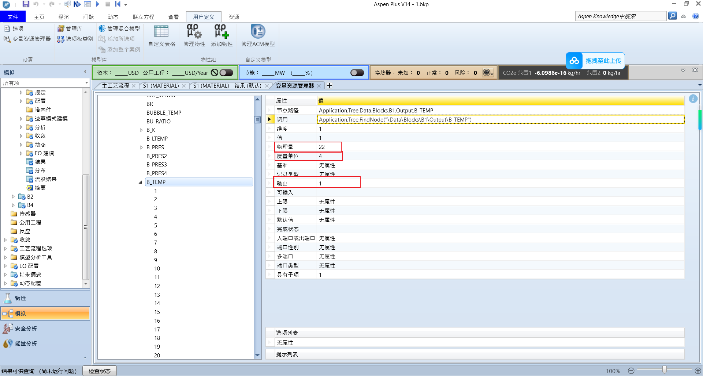
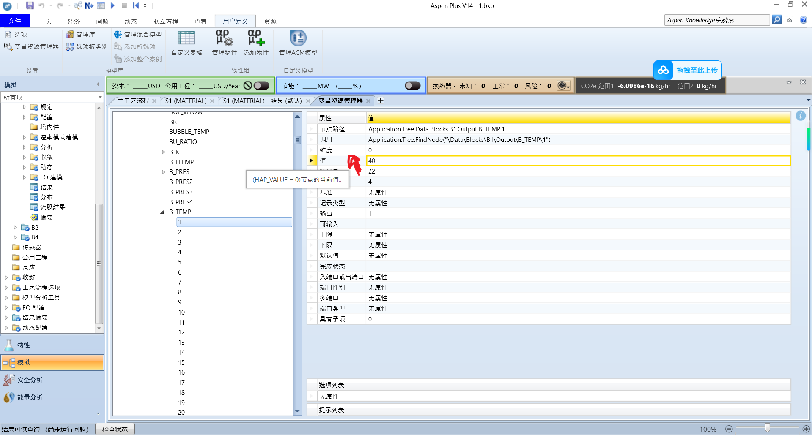
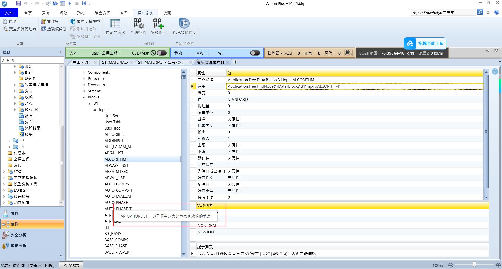

各位好，这里是 **MrsJone**！

今天对我来说是一个特别的日子——**公众号粉丝突破 1000 人啦！** 🎉

首先，特别感谢各位对 MrsJone 的点赞和关注，也感谢评论区朋友们的赞赏与支持。你们的每一个关注，都是我持续更新、更加努力的动力！


先把咱们的交流大本营放出来，欢迎志同道合的朋友加入 **QQ群：562721026**。

好了，寒暄过后，咱们进入正题。今天主要通过 Python 自动化，来聊一聊 Aspen 中一个非常重要但常被忽视的概念——**AttributeValue**。

一.问题导入：除了“数值”，我们还能获取什么？

当我们使用 Python 连接 Aspen 时，最常见的操作就是抓取某个变量的数据。 例如，我们想获取模块 `B1` 中塔板 1 的温度（如下图所示）：


    图1 这里我们展示模块B1的塔板1温度

通常，我们会使用以下代码来获取它的**值**：

`TEM=Application.Tree.FindNode("\Data\Blocks\B1\Output\B_TEMP").Value`

**问题来了：** 如果我们想获取这个变量的**度量单位**（如 C 或 K）、**物理量类型**（如 Temperature）、或者它的**输入输出状态**，该怎么办呢？



这个时候就必须提到AttributeValue了

二.什么是AttributeValue？

在 Aspen 的官方定义中（当然，也可以看作是我教程里的定义）：

你可以通过 `AttributeValue` 和 `AttributeType` 属性获取节点的**附加信息**（称为 attributes）。这两个属性都需要传入一个属性编号参数，该编号是 `HAPAttributeNumber` 枚举类中的枚举值。


简单来说，如果 `Value` 是一个人的“名字”，那么 `AttributeValue` 就像是查看这个人的“身份证”，能看到性别、籍贯等更多信息。


Aspen 内部为每一个属性都分配了一个整数 ID。例如，最基础的“数值”属性，在枚举中对应的名字是 `HAPVALUE`，对应的 ID 是 `0`。

为什么HAP_VALUE=0呢，我们在变量浏览器中拖动变量名，也能验证这一点：



我们就能看到值HAP_VALUE表示0

这意味着，Aspen 内部有成百上千个这样的 ID。那么，如何知道 `HAP_UNIT` 或其他属性对应的 ID 是多少呢？我们需要破解 `happ.tlb` 文件。

三.如何破解happ.ltb

为了获取所有的属性 ID 对照表，我们可以利用 Python 的 `win32com` 库来解析 Aspen 的类型库文件（Type Library）。

```Plain Text
import win32com.client as win32
import pythoncom

# 1. 装载类型库
tlb = pythoncom.LoadTypeLib(r'D:\aspenruanjian\AprSystem V14.0\GUI\Xeq\happ.tlb')
#这个路径表示的是你下载Aspen的时候的地址
# 2. 找到 HAPAttributeNumber 枚举
for i in range(tlb.GetTypeInfoCount()):
    ti = tlb.GetTypeInfo(i)
    name, *_ = tlb.GetDocumentation(i)   # 用 *_ 吃掉剩余 3 个返回值
    if name == 'HAPAttributeNumber':
        break

# 3. 枚举每个成员
ta = ti.GetTypeAttr()
for j in range(ta.cVars):
    vd = ti.GetVarDesc(j)
    mem_name, *_ = ti.GetDocumentation(vd.memid)
    value = vd.value
    print(f"{mem_name:<25} = {value}")
```

运行这段代码，你会得到一个长长的列表。我已经整理了部分常用的放在我的网站上（[https://wenxiaoshuo.github.io/AspenWithPython/](https://wenxiaoshuo.github.io/AspenWithPython/)），这里列举一部分：

```Plain Text
HAP_VALUE                 = 0
HAP_RESERVED1             = 1
HAP_UNITROW               = 2
HAP_UNITCOL               = 3
HAP_RESERVED2             = 4
HAP_OPTIONLIST            = 5
HAP_RECORDTYPE            = 6
HAP_ENTERABLE             = 7
HAP_UPPERLIMIT            = 8
HAP_LOWERLIMIT            = 9
HAP_VALUEDEFAULT          = 10
HAP_USERENTERED           = 11
HAP_COMPSTATUS            = 12
HAP_BASIS                 = 13
HAP_INOUT                 = 14
HAP_PORTSEX               = 15
HAP_MULTIPORT             = 16
HAP_PORTTYPE              = 17
HAP_OUTVAR                = 18
HAP_PROMPT                = 19
HAP_PRETENDNOTENTERED     = 20
```

四.AttributeValue 的使用方法

#### 1. 获取数值 (基础)

虽然我们可以直接用 `.Value`，但用 `AttributeValue` 也可以实现同样的效果：

```Plain Text
HAP_VALUE=0
c=aspen.Tree.FindNode(r"\Data\Blocks\B1\Output\B_TEMP\1").AttributeValue(HAP_VALUE)
print(c)
#前面说了HAP_VALUE=0
```

#### 2. 获取物理量/单位类型

回到开头的问题，怎么知道这个变量是表示“温度”还是“压力”？我们需要 `HAPUNITROW` (ID=2)。


我们从这里得到，HAP_UNITROW来表示物理量，为2

```Plain Text
HAP_UNITROW=2
c=aspen.Tree.FindNode(r"\Data\Blocks\B1\Output\B_TEMP\1").AttributeValue(HAP_UNITROW)
print(c)
#22
```

同时根据这个，我们可以看选项列表和提示列表

3.获取选型列表和提示列表

（1）.看HAP_**


（2）.因为这个是列表，所以我们需要用以下方式获取

```Plain Text
h=aspen.Tree.FindNode("\Data\Blocks\B1\Input\ALGORITHM").AttributeValue(5).Elements
for i in h:
    print(i)
```

（3）.提示列表



```Plain Text
h=aspen.Tree.FindNode("\Data\Blocks\B1\Input\ALGORITHM")
h.AttributeValue(19)
#'收敛方法。除非收敛 = 自定义("规定 | 设置 | 配置"页)，否则不能修改。'
```

五.进阶：如何修改属性 (SetAttributeValue)

在 Python 中使用 `help(node)` 往往查不到详细文档，但在 COM 接口层面，它的定义如下：

> **SetAttributeValue(attrnumber, force, arg2)**

    - **attrnumber**: 属性编号（查阅上面的 HAP 枚举表）。

    - **force**: 强制标志。`0` 或 `False` 为正常修改；`1` 或 `True` 表示强制覆盖（即使被锁定）。

    - **arg2**: **你要写入的新值**。


> **注意**：这个方法通常用于修改那些无法通过简单的 `SetValue` 直接操作的底层属性。

2.实操案例

假设我们要修改某个模块的计算基准 `B:F_BASIS`，我们可以这样做：


我们可以通过SetAttributeValue进行修改

```Plain Text
node3=aspen.Tree.FindNode("\Data\Blocks\B1\Input\B:F_BASIS")
node3.SetAttributeValue(0,False,"MASS")
#第一个0表示HAP_**,第二个表示非强制修改,第三个表示值
```


代码执行后，你会发现 Aspen 中的设置已经成功变为 "MASS"。同理，这种方法极其强大，甚至可以用来修改变量的度量单位。

六.总结

今天我们深入探讨了 Aspen 自动化中两个看似冷门但功能强大的方法：

1. **AttributeValue**: 用于获取变量的“元数据”（如单位、选项、提示）。

2. **SetAttributeValue**: 用于更底层地修改变量属性。

七.悄悄话

最后，想和大家聊几句心里话。

我是来自沧州交通学院制药工程专业的一名学生。从大一到大三，我一直在默默运营这个公众号。在很长一段时间里，粉丝数从 0 慢慢涨到了 134 人。

但就在最近这短短十天里，粉丝数突然暴涨了 1000 人！这让我既惊讶又感动。

承蒙错爱，不胜感激。

我一直把这里当作一个记录学习历程的个人博客，分享我在探索 Aspen 和 Python 过程中的点滴。能得到这么多朋友的认可，真的非常开心。

未来的日子里，我会继续分享更多高质量的干货。如果你觉得这篇文章对你有帮助，欢迎**点赞** + **在看**！

谢谢各位！

